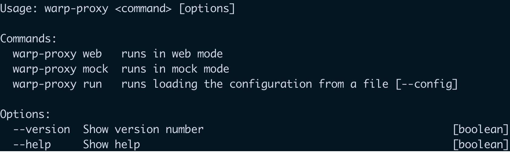

<h1 align="center">
  <a href="https://www.wearereasonablepeople.com/">
    warp-proxy
  </a>
</h1>

<p align="center">
  <strong>Proxy it. No wait,  mock it!</strong><br />
  <strong>Just delicious when testing and developing.</strong><br />
  <span>Relies on <a href="https://github.com/http-party/node-http-proxy">
    node-http-proxy</a> and <a href="https://nodejs.org/api/http.html">
    node http api
  </a></span>
</p>

<p align="center">
  
</p>

## Description
A simple command line to quickly start a web server which proxys your requests to an external server or to local files (JSON).
Very helpful for testing and development.

*Not made to be used in production. Use at your own risk.*

## Getting Started

Install warp-proxy using [`npm`](https://www.npmjs.com/):

```bash
npm install warp-proxy # globally accessible

npm install warp-proxy --save-dev # only accessible via npm package.json commands
```

## Usage
```bash
# Proxying all requests to a remote server
warp-proxy web --port 6543 --target http://mydesiredserver:1234 

# Proxying all request to local json files
warp-proxy mock --port 6543 --directory ./mymocksfolder/

# Using a config.js file
warp-proxy run --config ./proxy-config.js

# Using npx you don't even need to install the package
npx warp-proxy web --port 6543 --target http://mydesiredserver:1234
```

## Configuration
When using the `run` command you can pass a custom configuration via the `--config` argument.

```js
module.exports = {
  mode: 'web', // or 'mock'
  port: 1234,

  // Proxying external servers
  target: 'http://mydesiredserver:1234',

  // Proxying local files
  directory: './folder/with/mocks',
}
```

## Proxying a web target
Relies on all properties from [node-http-proxy](https://github.com/http-party/node-http-proxy#options)

Feel free to extend your config file with any property from `node-http-proxy`

```js
module.exports = {
  port: 1234,
  target: 'http://mydesiredserver:1234',
  ...node_http_proxy_properties
}
```

## Proxying local files
Assuming your directory is: `--directory ./root/`

To mock the following request: 
```c#
[GET] http://address:1234/repositories/administrators/1234?param=value
└───────────────────────┘ └──────────┘ └────────────┘ └──────────────┘
   root folder + /GET/   |   FOLDER   |    FOLDER    |    JSON FILE
```

your folder structure should look like this
```bash
└─root
  └─GET
    └─repositories
      └─administrators
        └─1234?param=value.json
```


Here's a second example:
```c#
[PUT] http://address:1234/language/countries/`
└───────────────────────┘ └──────┘ └───────┘
   root folder + /PUT/   | FOLDER |JSON FILE
```

your folder structure should look like this

```bash
└─root
  └─PUT
    └─language
      └─countries.json
```

## License

[MIT licensed](./LICENSE)
